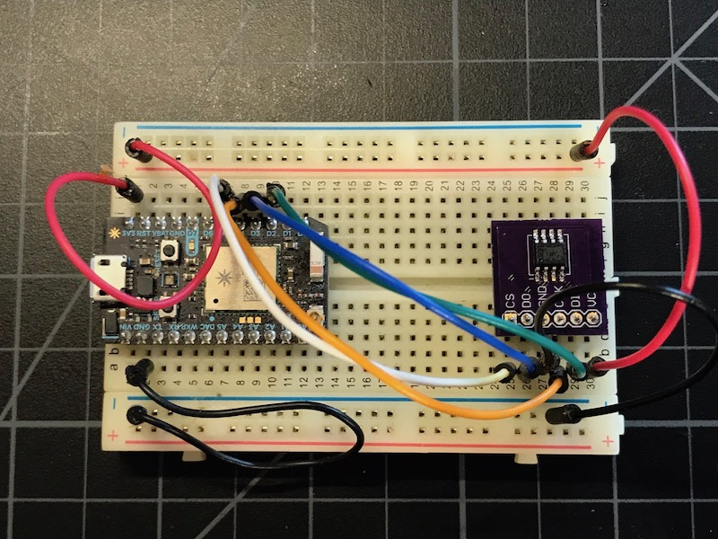
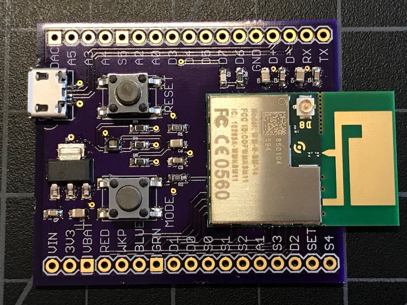

# SpiffsParticleRK

*Port of the SPIFFS library for the Particle platform*

## Introduction

The [excellent SPIFFS library](https://github.com/pellepl/spiffs) provides a simple file system on a NOR flash chip. This is a port of the library for the Particle platform, with a few convenience helpers to make using it easier from C++ and using standard Particle/Arduino/Wiring APIs.

Both the original SPIFFS library and this port and MIT licensed, so you can use them in open-source or in closed-source commercial products without a fee or license.

## Flash Support

This library supports SPI-connected NOR flash chips. These are typically tiny 8-SOIC surface mount chips, intended to be included on your own circuit board. There are also breadboard adapters that are available, shown in the examples below.

The chips are really inexpensive, less than US$0.60 in single quantities for a 1 Mbyte flash. They're available in sizes up to 16 Mbyte.

SPI flash is less expensive than SD cards, and do not need an adapter or card slot. Of course they're not removable, either.

The underlying [SpiFlashRK library](https://github.com/rickkas7/SpiFlashRK) library supports SPI NOR flash from

- ISSI, such as a [IS25LQ080B](http://www.digikey.com/product-detail/en/issi-integrated-silicon-solution-inc/IS25LQ080B-JNLE/706-1331-ND/5189766).
- Winbond, such as a [W25Q32](https://www.digikey.com/product-detail/en/winbond-electronics/W25Q32JVSSIQ/W25Q32JVSSIQ-ND/5803981).
- Macronix, such as the [MX25L8006EM1I-12G](https://www.digikey.com/product-detail/en/macronix/MX25L8006EM1I-12G/1092-1117-ND/2744800)
- The external 1 Mbyte flash on the P1 module
- Probably others

It does not support I2C flash, SD cards, or non-flash chips like FRAM.

## Instantiating an SpiFlash object

You typically instantiate an object to interface to the flash chip as a global variable:

```
SpiFlashISSI spiFlash(SPI, A2);
```

ISSI flash connected to the primary SPI with A2 as the CS (chip select or SS).

```
SpiFlashWinbond spiFlash(SPI, A2);
```

Winbond flash connected to the primary SPI with A2 as the CS (chip select or SS).

```
SpiFlashWinbond spiFlash(SPI1, D5);
```

Winbond flash connected to the secondary SPI, SPI1, with D5 as the CS (chip select or SS).

```
SpiFlashMacronix spiFlash(SPI1, D5);
```

Macronix flash connected to the secondary SPI, SPI1, with D5 as the CS (chip select or SS). This is the recommended for use on the E-Series module. Note that this is the 0.154", 3.90mm width 8-SOIC package.


```
SpiFlashP1 spiFlash;
```

The external flash on the P1 module. This extra flash chip is entirely available for your user; it is not used by the system firmware. You can only use this on the P1; it relies on system functions that are not available on other devices.


## Connecting the hardware

The real intention is to reflow the 8-SOIC module directly to your custom circuit board. However, for prototyping, here are some examples:

For the primary SPI (SPI):

| Name | Flash Alt Name | Particle Pin | Example Color |
| ---- | -------------- | ------------ | ------------- |
| SS   | CS             | A2           | White         |
| SCK  | CLK            | A3           | Orange        |
| MISO | DO             | A4           | Blue          |
| MOSI | D1             | A5           | Green         |


For the secondary SPI (SPI1):

| Name | Flash Alt Name | Particle Pin | Example Color |
| ---- | -------------- | ------------ | ------------- |
| SS   | CS             | D5           | White         |
| SCK  | CLK            | D4           | Orange        |
| MISO | DO             | D3           | Blue          |
| MOSI | D1             | D2           | Green         |

Note that the SS/CS line can be any available GPIO pin, not just the one specified in the table above.

- Electron using Primary SPI


- Photon using Secondary SPI (SPI1)



- Photon using Primary SPI and a poorly hand-soldered 8-SOIC adapter


- E-series evaluation kit with a [Macronix MX25L8006EM1I-12G](https://www.digikey.com/product-detail/en/macronix/MX25L8006EM1I-12G/1092-1117-ND/2744800) soldered to the E-series module (outlined in pink).


- P1 module (extra flash is under the can)



## Setting up the SpiffsParticle object


## Using the SPIFFS API

### Background

A few things about SPIFFS:

- It's relatively small, way smaller than SDFAT at least.
- It has the bare minimum of things you need to store files.
- You can allocate all or part of the flash chip to SPIFFS.

In particular, there are two important limitations:

- It does not support subdirectories; all files are in a single directory.
- Filenames are limited to 31 characters.
- It does not have file timestamps (modification or creation times).

Within the scope of how you use SPIFFS these shouldn't be unreasonable limitations, though you should be aware.

Like most file systems, there are a few things you must do:

- You must mount the file system, typically at startup.
- If your flash is blank, you'll need to format the file system.
- You can iterate the top level directory to find the file names in it.
- In order to use data in a file, you must open it and get a file handle, read or write, then close it.
- There are a finite number of files that can be open, but you can set the maximum. The default is 4.
- If you think the file system is corrupted, you can check and repair it.

Once you get it working, there is some fine-tuning you can do:

- The cache size is programmable, which speeds up operations at the cost of additional RAM. The default is 2 logical blocks.
- The logical block size is programmable. Using larger blocks can make using large files more efficient in flash storage, at the cost of more RAM and making small files less efficient in flash storage. The default is 4K, and can't be made smaller but can be made larger.


## Using the Arduino/Wiring File API


## Resource usage

